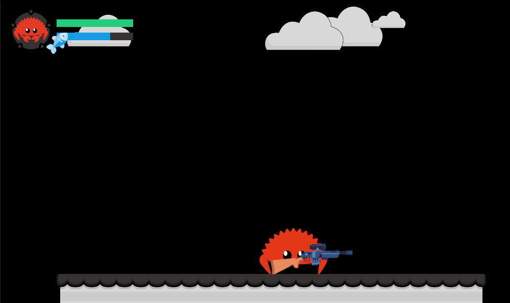

    
     
    
    

A thrilling action game where your favorite Ferris the crab and the rust mascot got guns and has taken up the duty to find evildoer languages while managing to keep itself alive. Take part in this awesome adventure and help Ferris be the best ever!

## Screenshots

Call of Ferris also comes with super hot slow motion for great bullet time and accurecy

## Thanks
- @s-mv for almost all of the assets!
